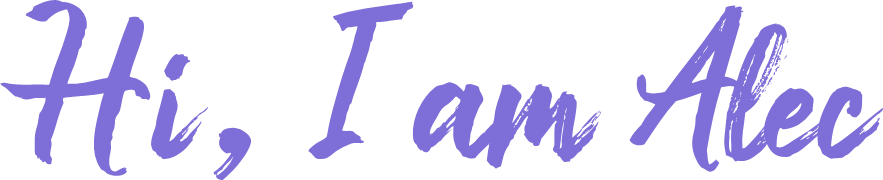

</a>

</a>

 

I'm a cybersecurity student at the ULB in belgium 🇧🇪

**About me**

-  Université Libre de Bruxelles
-  C++ lover
- 🎓 just graduated in computer science
- 🔐 undertaking a master in cybersecurity

#### Languages:

#### Tools:

|  |  |
| ------------- | ------------- |

#### Some Projects

